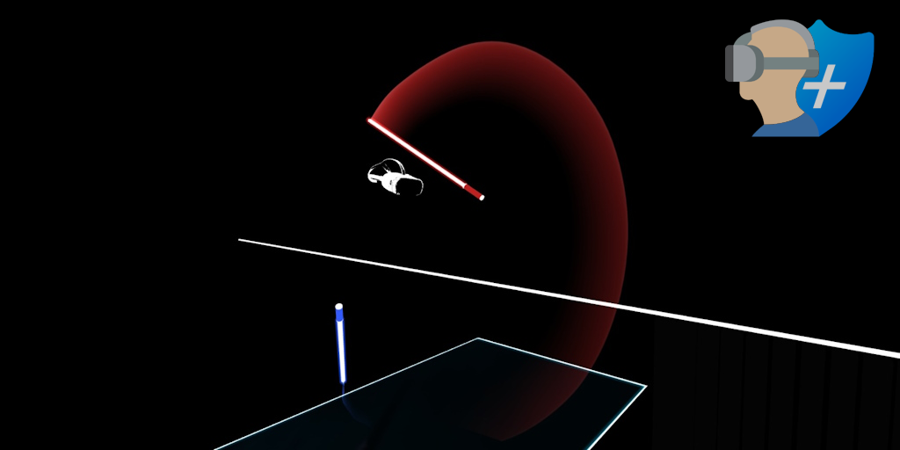

**MetaGuard++: Deep Motion Masking for Anonymizing Virtual Reality Motion Data**

Research has shown that the head and hand motion data measured by virtual reality (VR) devices can uniquely identify over 50,000 users with nearly 95% accuracy [[1]](https://www.usenix.org/conference/usenixsecurity23/presentation/nair-identification). Previous attempts to anonymize VR motion data have used differential privacy [[2]](https://arxiv.org/abs/2208.05604), but these techniques fail in light of more sophisticated recent attacks. MetaGuard++ uses a new technique we call "deep motion masking" to anonymize VR motion data in a way that is both more secure and usable than previous attempts.
The resulting system respects causality and can be deployed on a stream of motion data in real-time. Due to use of deep learning, MetaGuard++ has the potential to anonymize more complicated data streams, such as full-body motion data, in the near future.

See it in action: [anonymized recording](https://replay.beatleader.xyz/?link=https://metaguard.github.io/MetaGuardPlus/preview/3-normalized/76561197970860970-ExpertPlus-Standard-3585B3438A5B78DEAFAAA9D8FBA9A9E88556D218.bsor).

#### Dependencies
We used Python v3.10.2 on Windows 10 for training and testing all components of our system. The names and recommended versions of all Python dependencies are listed below. No other platforms or versions are officially supported.
- numpy v1.25.1
- pandas v1.4.3
- tqdm v4.64.0
- py_bsor v0.9.14
- tensorflow v2.10.1
- matplotlib v3.5.2
- lightgbm v3.3.3
- scikit-learn v1.2.0

#### Dataset
Training and testing this system requires use of the Berkeley Open Extended Reality Recording Dataset 2023 (BOXRR-23) dataset, available for free at https://rdi.berkeley.edu/metaverse/boxrr-23/.

#### Usage

##### 1. Data Sampling: `data/`

- To sample replays for training the action similarity model, run `d01-action-similarity.py`.
- To sample replays for training the user similarity model, run `d02-user-similarity.py`.
- To sample replays for evaluating the user identification accuracy, run `d03-user-identification.py`.

##### 2. Components: `parts/`

- To train the action similarity model, run `p01-action-similarity.py`.
  - The action similarity model can be fine-tuned by running `p01x-tune-action-similarity.py`.
- To train the user similarity model, run `p02-user-similarity.py`.
  - The user similarity model can be fine-tuned by running `p02x-tune-user-similarity.py`.
- To train the anonymization model, run `p03-anonymizer.py`.
- To train the normalization (noise reduction) model, run `p04-normalizer.py`.

##### 3. Preview: `preview/`

- To preview the anonymized motion data with and without normalization, place one or more Beat Saber replays in the `0-replays` folder and run `preview.py`. The control, anonymized, and normalized versions of the replays will be placed in the `1-control`, `2-anonymized`, and `3-normalized` folders, respectively. You can then use a [web replay viewer](https://replay.beatleader.xyz) to visualize the replays.

##### 4. Evaluation: `evaluation/`

- Run `e01-build-usability.py` to set up the randomized human study portion of the evaluation. Place responses in `usability/results.txt` in CSV format, then run `e02-analyze-usability.py` to evaluate the usability results.
- To run the anonymity evaluation using the method of Miller et al. (2020) [[3]](https://www.nature.com/articles/s41598-020-74486-y), run `e03-miller-features.py` and then run `e04-miller-test.py`.
- To run the anonymity evaluation using the method of Nair et al. (2023) [[1]](https://www.usenix.org/conference/usenixsecurity23/presentation/nair-identification), run `e05-nair-features.py` and then run `e06-nair-test.py`.
- To run the anonymity evaluation using our new LSTM-based method, run `e07-funnel-features.py` and then run `e08-funnel-test.py`.

#### Sample Results

All of the below results were obtained using a workstation PC running Windows 10 v10.0.19045 r19045 with an AMD Ryzen 9 5950X 16-Core 3.40 GHz CPU, NVIDIA GeForce RTX 3090 GPU, and 128 GB of DDR4 RAM.

##### Observed Runtime

The observed runtime of each script was as follows:

| **Script**                  | **Runtime** |
|-----------------------------|-------------|
| d01-action-similarity       | 55h 40m 5s  |
| d02-user-similarity         | 57h 12m 9s  |
| d03-user-identification     | 3h 24m 27s  |
|                             |             |
| p01-action-similarity       | 3h 3m 52s   |
| p01x-tune-action-similarity | 0h 23m 22s  |
| p02-user-similarity         | 0h 57m 1s   |
| p02x-tune-user-similarity   | 0h 21m 8s   |
| p03-anonymizer              | 3h 15m 15s  |
| p04-normalizer              | 0h 56m 51s  |
|                             |             |
| e03-miller-features         | 0h 40m 51s  |
| e04-miller-test             | 0h 5m 9s    |
| e05-nair-features           | 3h 41m 58s  |
| e06-nair-test               | 1h 12m 17s  |
| e07-funnel-features         | 0h 0m 34s   |
| e08-funnel-test             | 0h 8m 18s   |

##### Observed Training Metrics

In our evaluation, the observed training metrics of each component were as follows:

- The action similarity model achieved 100.00% training accuracy, 99.53% validation accuracy, and 99.40% testing accuracy (best epoch: 156).
- The user similarity model achieved 97.94% training accuracy, 92.60% validation accuracy, and 92.81% testing accuracy (best epoch: 27).
- The anonymization model achieved anonymization accuracy of 95.54% in training and 94.71% in testing, with 100.00% action similarity accuracy.
- The normalization model achieved a mean squared error of 0.0015 and a mean absolute error of 0.0249.

##### Observed Anonymity Results

We performed our anonymity evaluation using 20 randomly sampled recordings of 1,000 Beat Saber players.

- Using the method of Miller et al. (2020) [[3]](https://www.nature.com/articles/s41598-020-74486-y), the users can be identified with 90.3% accuracy. With MetaGuard++, the accuracy drops to 1.5% (non-adaptive) or 1.2% (adaptive).
- Using the method of Nair et al. (2022) [[1]](https://www.usenix.org/conference/usenixsecurity23/presentation/nair-identification), the users can be identified with 91.0% accuracy. With MetaGuard++, the accuracy drops to 3.1% (non-adaptive) or 3.5% (adaptive).
- Using our new LSTM-based method, the users can be identified with 96.5% accuracy. With MetaGuard++, the accuracy drops to 3.7% (non-adaptive) or 0.1% (adaptive).

Copyright &copy;2023 Berkeley RDI -- License [BSD](https://github.com/metaguard/metaguardplus/blob/main/LICENSE)

_We appreciate the support of Meta Platforms, the Minderoo Foundation, the National Science Foundation, the National Physical Science Consortium, the Fannie and John Hertz Foundation, and the Berkeley Center for Responsible, Decentralized Intelligence._
